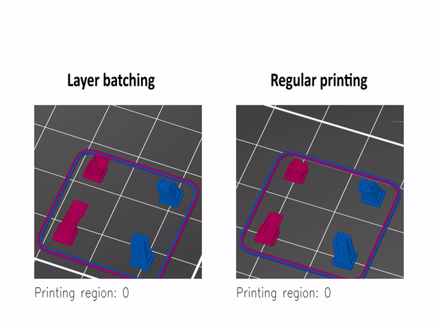

# **PrusaSlicer:** Interlayer color clustering (tool aggregation fork)

[PrusaSlicer](https://www.prusa3d.com/prusaslicer/) takes 3D models (STL, OBJ, AMF) and converts them into G-code instructions for FFF printers or PNG layers for mSLA 3D printers. It's compatible with any modern printer based on the RepRap toolchain, including all those based on the Marlin, Prusa, Sprinter and Repetier firmware. It also works with Mach3, LinuxCNC and Machinekit controllers.

PrusaSlicer is based on [Slic3r](https://github.com/Slic3r/Slic3r) by Alessandro Ranellucci and the RepRap community. See the [project homepage](https://www.prusa3d.com/slic3r-prusa-edition/) and the [documentation directory](doc/) for more information.

### Added features

The given fork introduces interlayer color clustering (tool aggregation) features.

### How to build?

If you want to compile the source yourself, follow the instructions on one of
these documentation pages:
* [Linux](doc/How%20to%20build%20-%20Linux%20et%20al.md)
* [macOS](doc/How%20to%20build%20-%20Mac%20OS.md)
* [Windows](doc/How%20to%20build%20-%20Windows.md)

### PrusaSlicer license

PrusaSlicer is licensed under the _GNU Affero General Public License, version 3_.
The PrusaSlicer is originally based on Slic3r by Alessandro Ranellucci.

### Use PrusaSlicer from the command line

Please refer to the [Command Line Interface](https://github.com/prusa3d/PrusaSlicer/wiki/Command-Line-Interface) wiki page.
