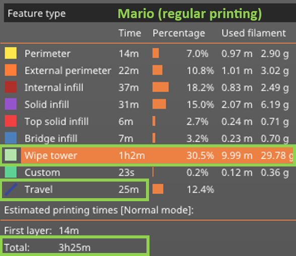
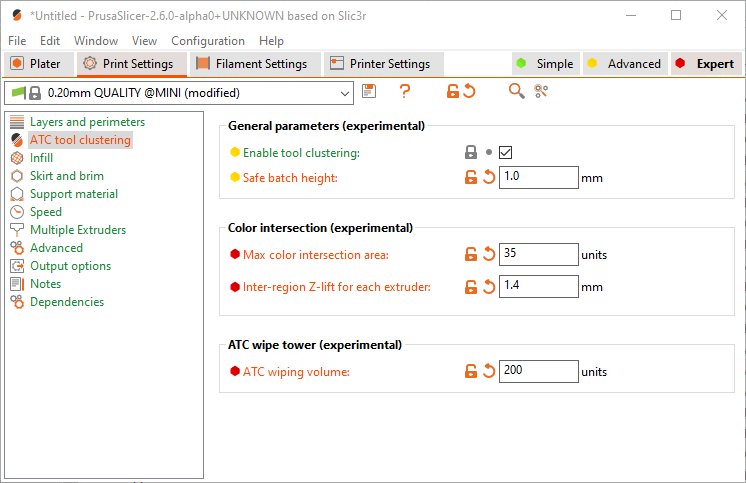
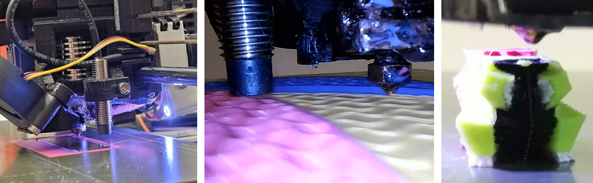

[wiki](https://github.com/apetsiuk/PrusaSlicer/wiki)


# PrusaSlicer: Interlayer Tool Clustering Fork
### Uses less material (1.7x), time and energy (1.4x)* 

<br />

>\*A. Petsiuk, B. Bloch, D. Vogt, M. Debora, J.M. Pearce, 2023, **"Toolpath optimization for multi-material/color additive manufacturing through non-planar interlayer tool clustering".** [**[SSRN]**](https://papers.ssrn.com/sol3/papers.cfm?abstract_id=4655383)

---

The given fork introduces tool aggregation features. The basis of the algorithm is to redistribute the fabrication order of color regions based on the maximum batch height and the degree of intersection of adjacent regions.

| **Regular printing** | **Tool clustering**   |
| :---:   | :---: |
|  |   |
|  |   |
|  |   |


## Added features

- :white_check_mark: Interlayer tool clustering
- :white_check_mark: Critical height tracking
- :white_check_mark: Adjustable level of intersections between neighboring regions
- :white_check_mark: GUI-integrated controls 
- :white_check_mark: Updated wipe tower generation
- :white_check_mark: Support clustering along with sliced layers 
- :white_check_mark: Updated print statistics
- :white_check_mark: Processed g-code visualization in GUI
- :white_check_mark: Added slide bar for clustered g-code regions in GUI
- :white_check_mark: Added slide bar for region intersections in GUI


## Features under development

- :x: Tool clustering for multi-object projects
- :x: Adaptive region intersections
- :x: Adaptive batch height


## GUI controls


<br />
The main variables are "Safe batch height" and "Max color intersection area".
<br />

## Colormap visualization


<br />
Added two sliders to the legend: ITC layer batching and ITC critical intersections
<br />


## Quality tests


## Nozzle area during printing


Video from an endoscope camera.


## Printed samples


Various models printed using tool clustering.

----


## Required slicing parameters

- Enable wipe tower (Print settings -> Multiple extruders -> Wipe tower -> Enable -> check)
- Disable sequential printing (Print settings -> Output options -> Sequential printing -> Complete individual objects -> uncheck)
- Extruder lift Z retraction (Printer settings -> Extruder X -> Retraction -> Lift Z = 1.6+ mm for each extruder)


## New variables

- `bool allow_layer_batching = true; // src/PrusaSlicer.cpp`
- `double safe_height = 0.35; // in mm, src/libslic3r/Print.cpp`
- `double critical_intersection = 0.05; // unscaled units, src/libslic3r/Print.cpp`
- `m_print_config.option<ConfigOptionFloats>("retract_lift")->values[working_extruder_idx] = 4.0; // in mm, Lift Z`


## Console usage (optional)

```
cd C:\src\PrusaSlicer\build\src\Release
prusa-slicer-console --export-gcode --output filename.gcode filename.3mf
```

----

## Multicolor models to test
- [Etta the Parrot](https://cults3d.com/en/3d-model/game/multi-color-parrot-remix-mosaicmanufacturing)
- [Two Color World](https://cults3d.com/en/3d-model/various/multi-color-world-with-stand)
- [Orange Coaster](https://cults3d.com/en/3d-model/home/multi-color-citrus-coaster)
- [Dory](https://cults3d.com/en/3d-model/game/multi-color-baby-dory)
- [Mario Keychain](https://cults3d.com/en/3d-model/game/multi-color-mario-keychain)
- [Eiffel Tower](https://cults3d.com/en/3d-model/architecture/eiffel-tower-color-french-flag)
- [Low Poly Squirtle](https://cults3d.com/en/3d-model/game/low-poly-squirtle-multi-and-dual-extrusion-version)


## Modified files

- src/PrusaSlicer.cpp
- src/libslic3r/Layer.hpp
- src/libslic3r/Print.cpp
- src/libslic3r/Print.hpp
- src/libslic3r/PrintBase.hpp
- src/libslic3r/SLAPrint.cpp
- src/libslic3r/SLAPrint.hpp
- src/libslic3r/GCode.cpp
- src/libslic3r/GCode.hpp


Added private members and methods to Slic3r::Layer and Slic3r::Print objects.


----

[PrusaSlicer](https://www.prusa3d.com/prusaslicer/) takes 3D models (STL, OBJ, AMF) and converts them into G-code instructions for FFF printers or PNG layers for mSLA 3D printers. It's compatible with any modern printer based on the RepRap toolchain, including all those based on the Marlin, Prusa, Sprinter and Repetier firmware. It also works with Mach3, LinuxCNC and Machinekit controllers.

PrusaSlicer is based on [Slic3r](https://github.com/Slic3r/Slic3r) by Alessandro Ranellucci and the RepRap community. See the [project homepage](https://www.prusa3d.com/slic3r-prusa-edition/) and the [documentation directory](doc/) for more information.

## Dependencies

- [Boost](https://www.boost.org/)
- [Eigen](https://eigen.tuxfamily.org/dox/GettingStarted.html)
- [Clipper](https://github.com/AngusJohnson/Clipper2)
- [LibIGL](https://libigl.github.io/)
- [OpenGL](https://www.opengl.org/)
- [CGAL](https://www.cgal.org/)


## How to build?

[Linux](doc/How%20to%20build%20-%20Linux%20et%20al.md) | [macOS](doc/How%20to%20build%20-%20Mac%20OS.md) | [Windows](doc/How%20to%20build%20-%20Windows.md)

#### Windows:

***1. Install the tools***

Install Visual Studio Community 2019 from visualstudio.microsoft.com/vs/. Older versions are not supported as PrusaSlicer requires support for C++17. Select all workload options for C++ and make sure to launch Visual Studio after install (to ensure that the full setup completes).

Install git for Windows from gitforwindows.org Download and run the exe accepting all defaults.

***2. Download sources***
Clone the respository. To place it in C:\src\PrusaSlicer, run:
```
c:> mkdir src
c:> cd src
c:\src> git clone https://github.com/prusa3d/PrusaSlicer.git
```

***3. Compile the dependencies***
Dependencies are updated seldomly, thus they are compiled out of the PrusaSlicer source tree. Go to the Windows Start Menu and Click on "Visual Studio 2019" folder, then select the ->"x64 Native Tools Command Prompt" to open a command window and run the following:
```
cd c:\src\PrusaSlicer\deps
mkdir build
cd build
cmake .. -G "Visual Studio 16 2019" -DDESTDIR="c:\src\PrusaSlicer-deps"
msbuild /m ALL_BUILD.vcxproj
```
***4. Generate Visual Studio project***
Go to the Windows Start Menu and Click on "Visual Studio 2019" folder, then select the ->"x64 Native Tools Command Prompt" to open a command window and run the following:
```
cd c:\src\PrusaSlicer\
mkdir build
cd build
cmake .. -G "Visual Studio 16 2019" -DCMAKE_PREFIX_PATH="c:\src\PrusaSlicer-deps\usr\local"
```

***5. Compile PrusaSlicer***
Double-click c:\src\PrusaSlicer\build\PrusaSlicer.sln to open in Visual Studio 2019. Select **PrusaSlicer_app_gui** as your startup project (right-click->Set as Startup Project).

Run Build->Rebuild Solution once to populate all required dependency modules. This is NOT done automatically when you build/run. If you run both Debug and Release variants, you will need to do this once for each.

Debug->Start Debugging or press F5

PrusaSlicer should start. You're up and running!

*note: Thanks to @douggorgen for the original guide, as an answer for an issue.*


## PrusaSlicer license

PrusaSlicer is licensed under the _GNU Affero General Public License, version 3_.
The PrusaSlicer is originally based on Slic3r by Alessandro Ranellucci.

## Use PrusaSlicer from the command line

Please refer to the [Command Line Interface](https://github.com/prusa3d/PrusaSlicer/wiki/Command-Line-Interface) wiki page.
