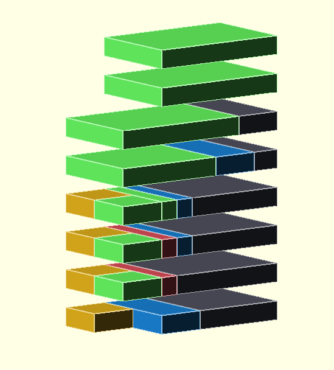
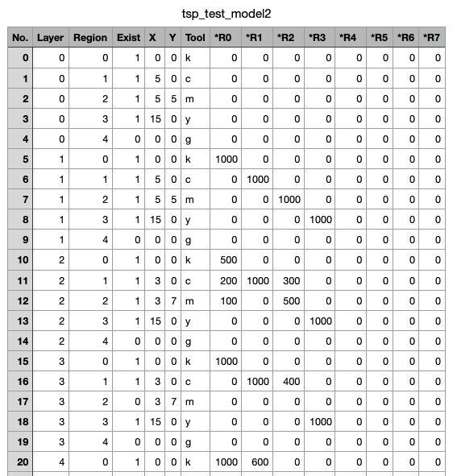

# Multi-Material Layer Batching Algorithm

| Source Model  | Printing Map | Printing Graph |
| ------------- | ------------- | ------------- |
|   |   |   |
| Source model represent a number of layers divided into colored `printing regions`  | Printing map CSV file is generated during slicing process, where `*R` column represent region overlay between neighboring regions  | This CSV file can be represented as a graph for further printing optimization. Each edge rpresents a single tool change.  |